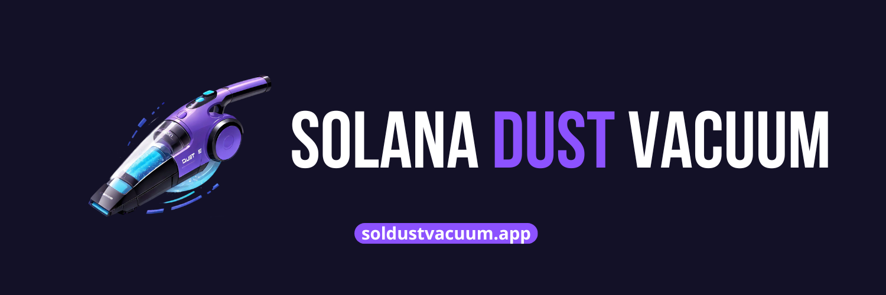

# Sol Dust Vacuum SDK
[](https://soldustvacuum.app/)
[](https://solana.com)
## Close solana accounts programatically and claim your rent in seconds. Suitable for multiple wallets, and easy to use.

This SDK is a programatically version of the [soldustvacuum.app](https://soldustvacuum.app), a tool that helps user closing their solana account and claiming their rent back.
With hardware wallets in mind, this SDK is designed for easy of use and to allow the user close accounts of multiple wallets at once.
Some of the key features are:
* Claim 0.002 SOL for every account closed.
* No gass fee is charged, wallets with no funds can use the tool.
* Close list of accounts or all accounts of a wallet.
* Close accounts of one or multiple wallets in a single function.
* Receive your rent of all accounts in a single address.
* Close accounts of all wallets in a folder.

Attention! To close a solana account, the account must be empty. Any remaning balance on the accounts will be burned on the closing proccess. Use the tool with caution, any missuse can lead to lost of funds.

The service is free. Sol Dust Vacuum only charges a small percentage on each account closed (0.0003 SOL).


## Quickstart
### install
```
npm install sol-dust-vacuum-sdk
```
```
yarn add sol-dust-vacuum-sdk
```

### Closing solana accounts from one wallet
```JS
import { SDV } from 'sol-dust-vacuum-sdk'
import { Keypair } from '@solana/web3.js'
import fs from 'fs'

async function main() {
    // the path to your wallet
    const jsonFile = fs.readFileSync(process.cwd() + "/wallet.json", 'utf8'); 
    const wallet = Keypair.fromSecretKey(new Uint8Array(JSON.parse(jsonFile.toString())));
    // you can specify your wallet path instead
    //const wallet = process.cwd() + "/wallet.json" 

    // Get your API key at https://soldustvacuum.app/sdk/keys
    const sdv = new SDV("YOUR_API_KEY_HERE")  
        
    // List of tokens to close.
    const tokens = ["rSzXH2jd6e6Mdro2MdRWHpRXA8QdZ8638AWi4fopump"]  

    const signature = await sdv.closeAccounts(wallet, tokens)
    console.log(signature)
}
main()

```
### Use custom RPC endpoint 
```JS
import { SDV } from 'sol-dust-vacuum-sdk'
import { Keypair } from '@solana/web3.js'
import fs from 'fs'

async function main() {
    // the path to your wallet
    const jsonFile = fs.readFileSync(process.cwd() + "/wallet.json", 'utf8'); 
    const wallet = Keypair.fromSecretKey(new Uint8Array(JSON.parse(jsonFile.toString())));
    // you can specify your wallet path instead
    //const wallet = process.cwd() + "/wallet.json" 

    const RPC_URL = "<YOUR_CUSTOM_RPC_ENDPOINT>"

    // Get your API key at https://soldustvacuum.app/sdk/keys
    const sdv = new SDV("YOUR_API_KEY_HERE")  
    // List of tokens to close.
    const tokens = ["rSzXH2jd6e6Mdro2MdRWHpRXA8QdZ8638AWi4fopump"]  

    const signature = await sdv.closeAccounts(wallet, tokens, RPC_URL)
    console.log(signature)
}
main()

```
### How to receive all funds in one address
```JS
import { SDV } from 'sol-dust-vacuum-sdk'
import { Keypair } from '@solana/web3.js'
import fs from 'fs'

async function main() {
    // the path to your wallet
    const jsonFile = fs.readFileSync(process.cwd() + "/wallet.json", 'utf8'); 
    const wallet = Keypair.fromSecretKey(new Uint8Array(JSON.parse(jsonFile.toString())));
    // you can specify your wallet path instead
    //const wallet = process.cwd() + "/wallet.json" 

    const RPC_URL = "<YOUR_CUSTOM_RPC_ENDPOINT>"

    const receiver = "DUSTPnALb5327hRCfxQdzHutuxeh88J4EWaT7eqq1PWP"

    // Get your API key at https://soldustvacuum.app/sdk/keys
    const sdv = new SDV("YOUR_API_KEY_HERE")  

    // List of tokens to close.
    const tokens = ["rSzXH2jd6e6Mdro2MdRWHpRXA8QdZ8638AWi4fopump"]  

    const signature = await sdv.closeAccounts(wallet, tokens, RPC_URL, receiver)
    console.log(signature)
}
main()

```
## How to use
### Closing solana accounts from one wallet
```JS
import { SDV } from 'sol-dust-vacuum-sdk'
import { Keypair } from '@solana/web3.js'
import fs from 'fs'

async function main() {
    // the path to your wallet
    const jsonFile = fs.readFileSync(process.cwd() + "/wallet.json", 'utf8'); 
    const wallet = Keypair.fromSecretKey(new Uint8Array(JSON.parse(jsonFile.toString())));
    // you can specify your wallet path instead
    //const wallet = process.cwd() + "/wallet.json" 

    // Get your API key at https://soldustvacuum.app/sdk/keys
    const sdv = new SDV("YOUR_API_KEY_HERE")  

    // List of tokens to close.
    const tokens = ["rSzXH2jd6e6Mdro2MdRWHpRXA8QdZ8638AWi4fopump"]  

    const signature = await sdv.closeAccounts(wallet, tokens)
    console.log(signature)
}
main()

```
### Closing all solana accounts from one wallet
```JS
import { SDV } from 'sol-dust-vacuum-sdk'
import { Keypair } from '@solana/web3.js'
import fs from 'fs'

async function main() {
    // the path to your wallet
    const jsonFile = fs.readFileSync(process.cwd() + "/wallet.json", 'utf8'); 
    const wallet = Keypair.fromSecretKey(new Uint8Array(JSON.parse(jsonFile.toString())));
    // you can specify your wallet path instead
    //const wallet = process.cwd() + "/wallet.json" 

    // Get your API key at https://soldustvacuum.app/sdk/keys
    const sdv = new SDV("YOUR_API_KEY_HERE")  

    // List of tokens to keep, any other token will be closed.
    const tokensToKeep = ["rSzXH2jd6e6Mdro2MdRWHpRXA8QdZ8638AWi4fopump"]  

    const signature = await sdv.closeAllAccounts(wallet, tokensToKeep)
    console.log(signature)
}
main()

```
### Closing solana accounts from multiple wallets
```JS
import { SDV } from 'sol-dust-vacuum-sdk'
import { Keypair } from '@solana/web3.js'
import fs from 'fs'

async function main() {
    const cwd = process.cwd();
    const jsonFile1 = fs.readFileSync(cwd + "/wallet1.json", 'utf8');
    const wallet1 = Keypair.fromSecretKey(new Uint8Array(JSON.parse(jsonFile1.toString())));
    const jsonFile2 = fs.readFileSync(cwd + "/wallet2.json", 'utf8');
    const wallet2 = Keypair.fromSecretKey(new Uint8Array(JSON.parse(jsonFile2.toString())));
    // you can specify your wallet path instead
    //const wallet1 = cwd + "/wallet1.json" 
    //const wallet2 = cwd + "/wallet2.json" 

    // Get your API key at https://soldustvacuum.app/sdk/keys
    const sdv = new SDV("YOUR_API_KEY_HERE")  
    // List of tokens to close.
    const tokens = ["rSzXH2jd6e6Mdro2MdRWHpRXA8QdZ8638AWi4fopump"]  

    const signature = await sdv.closeAccountsBatch([wallet1, wallet2], tokens)
    console.log(signature)
}
main()

```
### Closing all solana accounts from multiple wallets
```JS
import { SDV } from 'sol-dust-vacuum-sdk'
import { Keypair } from '@solana/web3.js'
import fs from 'fs'

async function main() {
    const cwd = process.cwd();
    const jsonFile1 = fs.readFileSync(cwd + "/wallet1.json", 'utf8');
    const wallet1 = Keypair.fromSecretKey(new Uint8Array(JSON.parse(jsonFile1.toString())));
    const jsonFile2 = fs.readFileSync(cwd + "/wallet2.json", 'utf8');
    const wallet2 = Keypair.fromSecretKey(new Uint8Array(JSON.parse(jsonFile2.toString())));
    // you can specify your wallet path instead
    //const wallet1 = cwd + "/wallet1.json" 
    //const wallet2 = cwd + "/wallet2.json" 

    // Get your API key at https://soldustvacuum.app/sdk/keys
    const sdv = new SDV("YOUR_API_KEY_HERE")  

    // List of tokens to keep, any other token will be closed.
    const tokensToKeep = ["rSzXH2jd6e6Mdro2MdRWHpRXA8QdZ8638AWi4fopump"]  

    // if tokens to keep is not provided all tokens will be selected
    const signature = await sdv.closeAllAccountsBatch([wallet1, wallet2]) 
    //const signature = await sdv.closeAllAccountsBatch([wallet1, wallet2], tokensToKeep) 
    console.log(signature)
}
main()

```
### Close solana accounts from all wallet in a folder
```JS
import { SDV } from 'sol-dust-vacuum-sdk'
import { Keypair } from '@solana/web3.js'
import fs from 'fs'

async function main() {
    // will read all json wallets on the folder
    const walletFolder = process.cwd() + "/wallets"  

    // Get your API key at https://soldustvacuum.app/sdk/keys
    const sdv = new SDV("YOUR_API_KEY_HERE")  

    // List of tokens to close.
    const tokens = ["rSzXH2jd6e6Mdro2MdRWHpRXA8QdZ8638AWi4fopump"]  

    const signature = await sdv.closeAccountsFolder(walletFolder, tokens) 
    console.log(signature)
}
main()

```
### Close all solana accounts from all wallet in a folder
```JS
import { SDV } from 'sol-dust-vacuum-sdk'
import { Keypair } from '@solana/web3.js'
import fs from 'fs'

async function main() {
    // will read all json wallets on the folder
    const walletFolder = process.cwd() + "/wallets"  

    // Get your API key at https://soldustvacuum.app/sdk/keys
    const sdv = new SDV("YOUR_API_KEY_HERE")  
    // List of tokens to keep, any other token will be closed.
    const tokensToKeep = ["rSzXH2jd6e6Mdro2MdRWHpRXA8QdZ8638AWi4fopump"]  

    // if tokens to keep is not provided all tokens will be selected
    const signature = await sdv.closeAllAccountsFolder(walletFolder) 
    //const signature = await sdv.closeAllAccountsFolder(walletFolder, tokensToKeep) 
    console.log(signature)
}
main()

```


